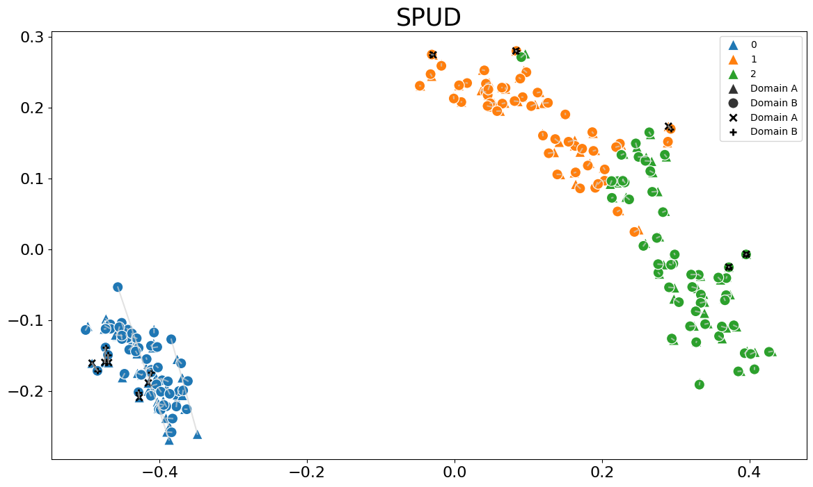

## Description
This repository contains two innovative methods for solving manifold alignment problems. The first method, **Shortest Paths on the Union of Domains (SPUD)**, focuses on finding the optimal path between points across multiple domains by using shortest path algorithms. The second method, **Manifold Alignment via Stochastic Hopping (MASH)**, introduces random stochastic hopping to improve alignment quality in noisy datasets. You can learn more about these methods by reading our linked paper.

Created Sept, 2024.


## How to Install
To install the `mashspud` package, run the following command:

```bash
pip install git+https://github.com/rustadadam/mashspud.git
```

## Linked Paper
https://www.overleaf.com/project/660ad3600ce0d5ec71338821

Also view as included in the repository as GDI.pdf.

## Code Example
Below is a quick code example of how to use SPUD from the `mashspud` package. The code implementation to MASH is similar. You can view full demonstrations of both MASH and SPUD in their respective deomnstration notebook files.  

*Example:*
```python
from mashspud import SPUD
from demonstration_helper import *

# Initialize the data
iris_features, iris_labels = prepare_dataset("csv_files/iris.csv")
iris_domainA, iris_domainB = split_features(iris_features, split = "distort") #Create domains
iris_anchors = create_anchors(int(len(iris_features)))[:10] #Create 10 random anchors

# Initialize SPUD and fit it
iris_spud = SPUD(knn = 8, verbose = 3)
iris_spud.fit(dataA = iris_domainA, dataB = iris_domainB, known_anchors=iris_anchors)

#Plot Embedding
iris_spud.plot_emb(labels = iris_labels)
```


## Citations 
View on the paper. 

## Authors
- Rhodes, Jake
- Rustad, Adam
